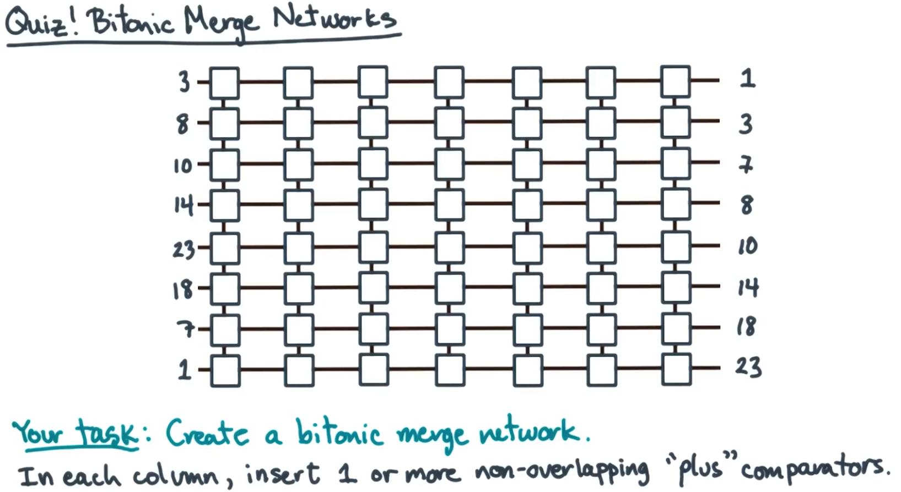

# Solution
Recall what a bitonic merge is. You take your n input elements and repeatedly apply a bitonic split to them until you run out of pairs (i.e. every possible pair has been made including the end where there are no pairs to be made in general)

We know that given a bitonic input sequence, that we can find the number of elements to go from our current element to find our pair by

$$n \over 2$$
So, given our input size n = 8, on our first set of matching pairs we must go 4 elements from our start element. Additionally we must remember the limitation of networks that comparators cannot overlap.

**Note**: Rows are referenced by the initial input sequence. At later points in the network, each wire will actually have a different value. Writing them down as you go can actually help you check your answer because you are able to calculate the sorted sequence yourself and put that on the right of your network. If your network results in values that don't match your expected output, you know you made a mistake in your pair selection somewhere in your network.

## Column 1
We can start at the first element of our sequence and count 4 elements down from that.

So our first pair is 3 and 23. Our next pair would start at the element after the one we ended on (i.e. 23). So we can start at 18 and check what the element 4 elements away from it is. That element is 8 but that would result in an overlapping comparator with out first comparator so this must be pushed to our next column.

## Column 2
We found that in our last column that we should continue making pairs starting at 18. We found that this was paired with 8 using a comparator. Just as before we proceed with the element immediately following where we ended. Looking at 10, we look four elements ahead and see 7 would be our pair. Again, this would overlap if we attempted this in our current column so this must be pushed to column 3.

## Column 3
We found that 10 and 7 should be paired following our work on column 2. We pair this up in column three and proceed from 7, starting with 1. Four elements from 1 we see 14. Unfortunately this would overlap our comparator for this column already so this pair must be made in column 4.

## Column 4
In column 4, we pair up 1 and 14 and we have now made it so that we have two bitonic subsequences. The first 4 results are a bitonic subsequence and the bottom 4 are a bitonic subsequence. We must not take the bitonic split of these subsequences. No further work is done in this column.

## Column 5
Starting from the first element in the first bitonic subsequence we select 3. We know that for this subsequence n = 4 so n/2=2. We go two elements from 3 to find 10. We can check if we can make another pairing without overlap for this subsequence but it is not possible.

For subsequence two we select the first element 23 and pair it with the element 2 away which is 7. Again check to see if another paring is possible without overlap but none is possible.

## Column 6
We proceed where we left off with the first subsequence and select 14 and pair it with 8, 2 elements away. All pairs have been made for this subsequence so we have no more to do for this one.

The second subsequence we match 18 and 1 in a similar fashion completing our pairs for this second subsequence.

## Column 7
At this point we divide our n by 2 again. n previously was 2 so we know need to go one element away for each subsequence. We have now have subsequences with 2 elements.
So we can just go down the list. 4-8, 10-14, 23-18, and 7-1. We stop after this because n/2=1 at this point and you can't make a pair with one element. We know have a sorted output that we could check against what we got sorting by hand if we weren't already given it in this case.
