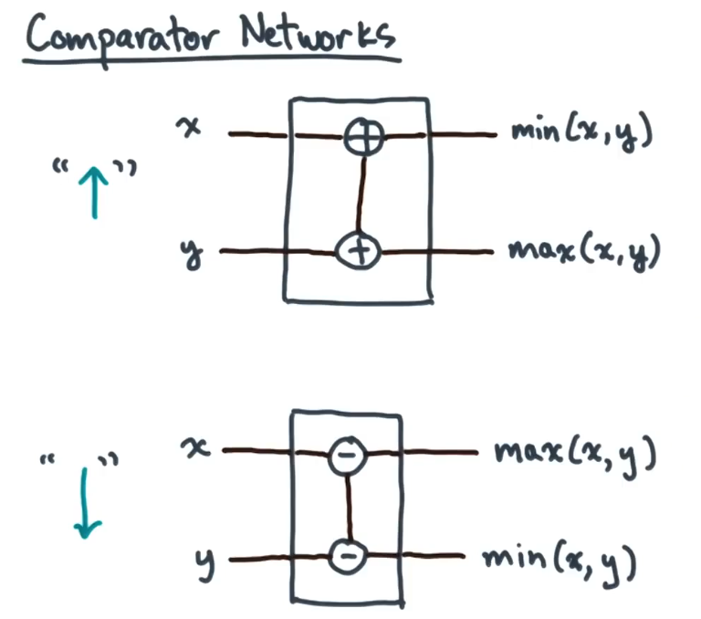
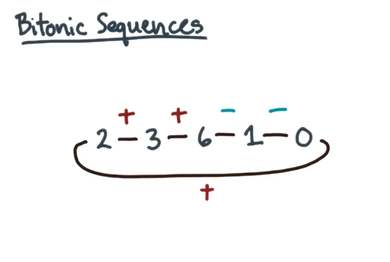

**Sorting Network**: A Fixed circuit that sorts its inputs using a special type of circuit element or gate called a comparator. It can help to think of it as "up" and "down" and where the arrow is pointing to the output "wire" where the min is going. The max goes on the other wire.
	-Increasing or plus comparator: Puts the smaller of its two inputs on the top wire output and the larger on the bottom wire
		- In other words, they produce output in increasing order when read from top to bottom
	- Decreasing or minus comparator: Puts the larger of its two input on the top wire output and the smaller on the bottom wire
		- In other words, they produce output in decreasing order when read from top to bottom

**Bitonic Sequences**: Is asequence of values where it initially is increasing and then switches to have all values decreasing. 
A sequence $$ a_1, a_2, \dots, a_n $$ is called **bitonic** if there exists an index k such that: $$ a_1 \leq a_2 \leq \dots \leq a_k \geq a_{k+1} \geq \dots \geq a_n $$ In other words, a bitonic sequence is one that first monotonically increases and then monotonically decreases.

If some circular shift can be applied to make the sequence bitonic then the sequence is bitonic.
- A quick way to check this is to treat a sequence like a loop (i.e. the previous element of the first element is the last element and the last element's next element is the first element) and make sure that all increases and decreases are consecutive. 
 

**Bitonic split**: When you pair the elements of a bitonic input sequence and then you apply mins and maxes to the pairs.
- This results in two bitonic subsequences
- To determine how to make these pairs, you can take n (your number of elements) and divide by 2. So for n = 32, you would pair together elements that are 16 elements apart from each other. That is to say, there are n/2 - 1 elements in between them.

**Bitonic Merge** (This results in a sorted sequence)
1. Do a bitonic split to get two bitonic subsequences
2. Repeat step 1 until you run out of pairs
