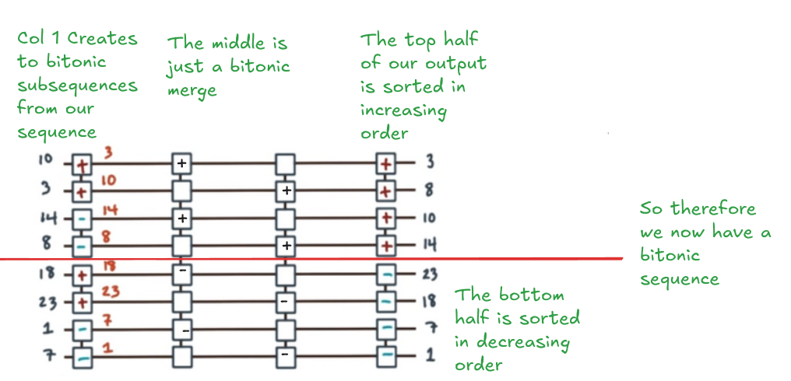

# Solution
First, we should recall the definition of a bitonic sequence.

A sequence 

$$ a_1, a_2, \dots, a_n $$
is called **bitonic** if there exists an index k such that: 

$$ a_1 \leq a_2 \leq \dots \leq a_k \geq a_{k+1} \geq \dots \geq a_n $$
In other words, a bitonic sequence is one that first monotonically increases and then monotonically decreases.

So our goal is to have a single sequence with two subsequences where one increases and one decreases.

This is equivalent to saying we want it to have half of it sorted in ascending order and half of it sorted in descending order.

We know that we can get a sorted output from performing a bitonic merge. In order to do that however we need to start with a bitonic sequence.

Well, we stated that we want two output subsequences with a particular sorting and we need to start with two subsequences that are bitonic to do a bitonic merge.

Lets split our input in two to make two subsequences and then do what we have to to make those subsequences bitonic.

Here we are lucky in that we can easily make the two subsequences bitonic but applying opposite comparators to the two pairs we can make in the subsequence. This quickly gives us a bitonic subsequence.

For this reason, after column 1 all work being done is to do a bitonic merge. 

Each subsequence is of size 4 so we do n/2 to get 2 which is how many elements away each pair is in the following pairing.

We proceed making pairs until all pairs are made and no overlaps can occur. In our example here, this will result in new subsequences of size two and we can just apply an increasing or decreasing comparator depending on the sort order we want our resulting subsequence to be.

To recap, the general steps are:
1. Take your arbitrary input and split it into two subsequences
2. For each subsequence use comparators as necessary to make it a bitonic subsequence
3. Do a bitonic merge on the bitonic subsequences you made applying the same comparator at each column to achieve either an ascending (plus) or descending (minus) sorted subsequence at the end
4. Your two resultant subsequences combined should give you a bitonic sequence
