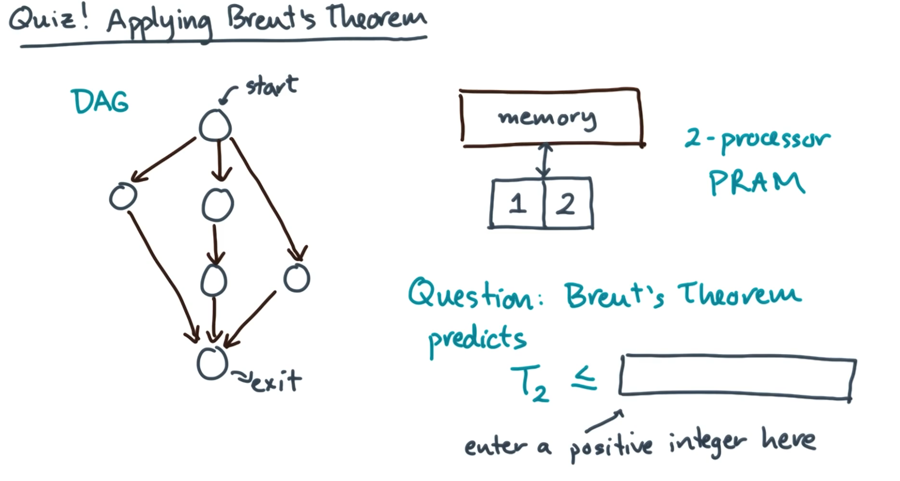

# Solution
Recall Brent's theorem:

 $$T_P \le {W - D \over P} + D$$
 
 This depends on work (W), Span (D), and the number of processors (P). P is given as part of the problem as 2 since we have a 2-processor PRAM.

Now to calculate work and span. 

Work is defined as the number of vertices/nodes in the DAG so by a simple count we have that W = 6.

Span is the number of vertices/nodes on the longest path in the DAG. By looking at the DAG we see that the longest path goes down the middle of the DAG with 4 vertices/nodes giving D = 4.

Substituting into Brent's theorem we have

 $$T_2 \le {W - D \over P} + D \le {6 - 4 \over 2} + 4 \le {2 \over 2} + 4 \le 5$$
