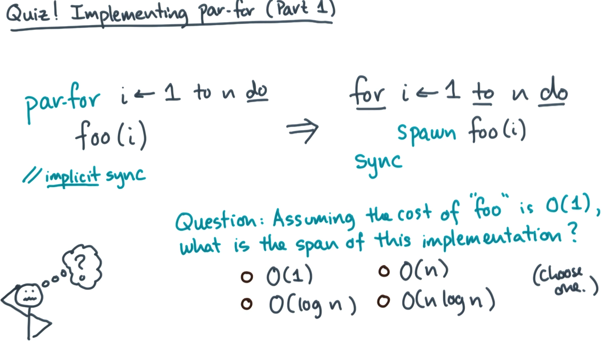

# Solution
Let's first think about what the DAG would look like without a spawn for foo(i) with the for loop still assuming that foo is O(1).

In that case, for each iteration, we would add one vertex to represent the work of foo(i) to our DAG and this would result in a DAG which is a straight line with a span which is mainly determined by n (since for each i in n, we call foo).

Let's add the spawn into the equation. For each iteration, we call foo(i) but we spin this off as parallel work. The work happening in parallel does not add to our longest path and our for loop is still sequential (i.e. each spawn is happening one after the other and not in parallel).

Therefore, the span is dominated by the n vertices created by looping giving us that span of the implementation is 

$$D(n)=O(n)$$
