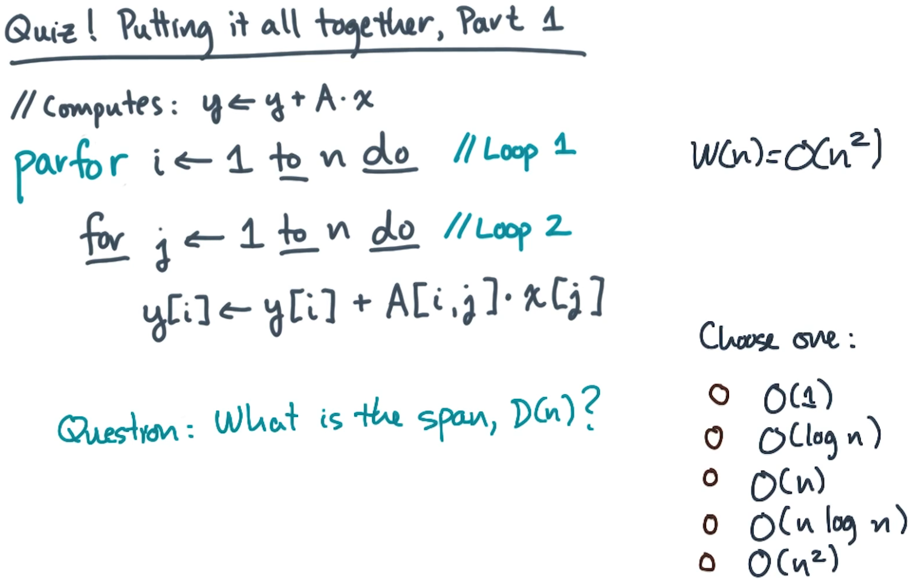

# Solution
Recall that the span D(n) is the number of vertices/nodes along the longest path in the DAG. 

Let's first consider how loop 1 contributes to the growth of this longest path. 

## Loop 1
From our assumption in this class, our parfor will use a divide and conquer approach meaning that at each step of calculation, the input n is divided by 2 and each subset of n is worked on independently. n is divided until there is only one item left at which point no further division is done and the calculation for the single item is completed. As we know from parallel operations at each level of the resulting DAG, each division will only add 1 vertex to each path, which means it only adds one to whatever our longest path is, our span.

To calculate the amount of vertices added to the path by this loop we just say it is log n.

With just loop 1, our span is 

$$D(n)=O(logn)$$

## Loop 2
As stated in loop 1, we will continue dividing our work until there is only one item to work on (the size of n on that recursive step is 1). In our case of this problem this means that each row of A is worked on in parallel.

At this point in our process we are going to be working linearly. For each operation we do we will be adding one node to our path. Since our for loop iterates from 1 to n, this means that for each of the paths in the DAG created by the parfor, we are going to add n vertices.

So what is this is in math terms 

$$D(n)=O(logn+n)$$

The length is dominated by the n term so in big-O our result is 

$$D(n)=O(n)$$
