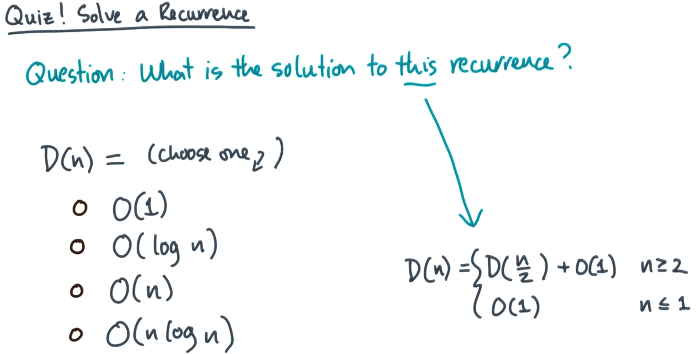

# Solution
The most direct way of solving the recurrence is by using the Master Theorem. Recall that the master theorem is defined as

$$T(n)=aT({n \over b})+\theta(n^c)$$

where a > 0, b > 1, and  d >= 0. Then we have

$$ T(n) = \begin{cases} \Theta(n^c) & \text{if } \log_b a < c \\ \Theta(n^c \log n) & \text{if } \log_b a = c \\ \Theta(n^{\log_b a}) & \text{if } \log_b a > c \end{cases} $$

Let's look to see if our recurrence for D(n) is in the form for the master theorem. We see that in our case a = 1, b = 2, c = 0 (because n^0 = 1) and we see that it takes the correct form.

Therefore we can solve using the master theorem by referencing the piecewise function given by the master theorem after finding the value of our log using a and b 

$$log_ba=log_21=0$$

Given this result we know that we use the middle function. Which gives us:

$$O(n^clogn)=O(n^0logn)=O(1logn)=O(logn)$$

This is our solution so we know that 

$$D(n)=O(logn)$$

The alternative solution of writing out a few recursive steps makes sense that it leads to us getting logn because you just repeatedly are halving n until n <= 1 which is equivalent to taking the logn given we use a log base 2.
